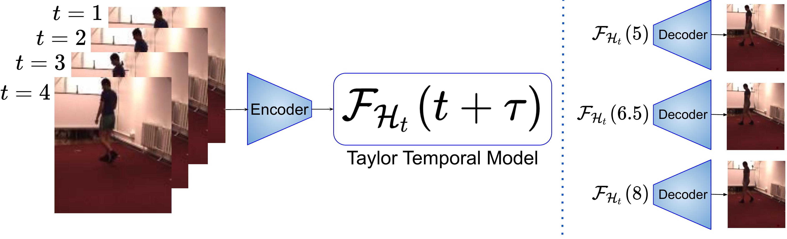

# TaylorSwiftNet
This repository contains the code for the paper [Taylor Swift: Taylor Driven Temporal Modeling for Swift Future Frame
Prediction](https://arxiv.org/pdf/2110.14392.pdf).



## Installation

Setup a conda environment and install all project dependencies.

```bash
conda env create --name taylor --file environment.yml
activate taylor
pip install -e .
```

## How to run the code

To train the MovingMNIST model, use

```bash
python core/main.py --cfg configs/moving_mnist/latest_config.yaml \
--set dataset.root <path_to_dataset>
```

All config parameters are described in `configs/default_config.py`. You can specify parameters by
setting them in a yaml config file or by passing them after `--set` (Format: `--set <key1>
<value1> <key2> <value2> ...`). 

To evaluate a previously trained model checkpoint, use

```bash
python core/main.py --cfg configs/moving_mnist/latest_config.yaml \
--set dataset.root <path_to_dataset> eval_only True model.resume True model.model_state_path <path_to_checkpoint.pt>
```


## Citation
If you use this code or our models, please cite our paper:
```latex
@inproceedings{taylor2022,
    Author    = {Saber Pourheydari, Emad Bahrami, Mohsen Fayyaz, Gianpiero Francesca, Mehdi Noroozi, Juergen Gall},
    Title     = {TaylorSwiftNet: Taylor Driven Temporal Modeling for Swift Future Frame Prediction},
    Booktitle = {British Machine Vision Conference (BMVC)},
    Year      = {2022}
}
```

### Contributors

<!-- readme: contributors -start -->
<table>
<tr>
    <td align="center">
        <a href="https://github.com/msaberp">
            
            <br />
            <sub><b>Saber Pourheydari</b></sub>
        </a>
    </td>
    <td align="center">
        <a href="https://3madbr.github.io">
            
            <br />
            <sub><b>Emad Bahrami</b></sub>
        </a>
    </td>
    <td align="center">
    <a href="https://mohsenfayyaz89.github.io/">
        
        <br />
        <sub><b>Mohsen Fayyaz</b></sub>
    </a>
    </td></tr>
</table>
<!-- readme: contributors -end -->

#### Acknowledgment
Felix helped us for refactoring and cleaning the original code.
<!-- readme: samslow,alandefreitas,atharwa-24,EmilStenstrom -start -->
<table>
<tr>
    <td align="center">
        <a href="https://github.com/felixbmuller">
            
            <br />
            <sub><b>Felix B. Müller</b></sub>
        </a>
    </td>
</table>
